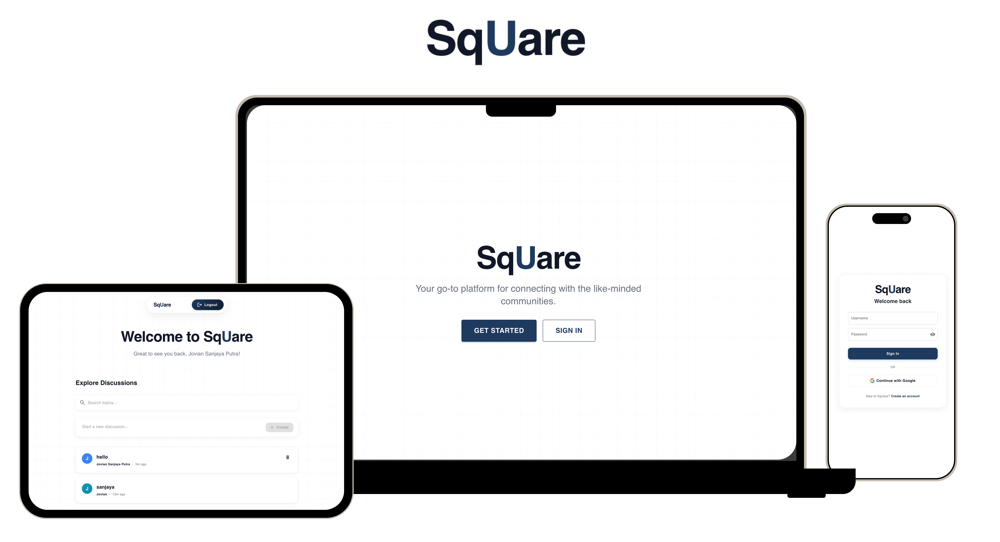

# SqUare - CVWO Assignment AY2025/26



## 1. About the Project

### 1.1 Description

SqUare is a full-stack web forum application designed for open discussions across various topics. This project was developed as part of the CVWO Assignment AY2025/26 for the School of Computing, National University of Singapore (NUS). For more details about the CVWO program, please visit [this link](https://www.comp.nus.edu.sg/~vwo/).

**Project Owner:** Jovian Sanjaya Putra  
**Matriculation Number:** A0334772Y

### 1.2 Tech Stack


### 1.3 Features

- User authentication with JWT and Google OAuth
- Create and manage discussion topics
- Post and comment on discussions
- Upvote/downvote system for posts and comments
- Search and sort functionality
- Responsive design with modern UI
- Full Docker containerization for easy deployment

## 2. Table of Contents

- [1. About the Project](#1-about-the-project)
  - [1.1 Description](#11-description)
  - [1.2 Tech Stack](#12-tech-stack)
  - [1.3 Features](#13-features)
- [2. Table of Contents](#2-table-of-contents)
- [3. Getting Started](#3-getting-started)
  - [3.1 Installation](#31-installation)
  - [3.2 Building and Running the App](#32-building-and-running-the-app)
- [4. Google OAuth Setup](#4-google-oauth-setup)
  - [4.1 Backend Setup](#41-backend-setup)
  - [4.2 Environment Variables](#42-environment-variables)
- [5. API Endpoints](#5-api-endpoints)
- [6. Project Structure](#6-project-structure)
- [7. Database Schema](#7-database-schema)
- [8. AI Usage Declaration](#8-ai-usage-declaration)

## 3. Getting Started

### 3.1 Installation

Start by cloning this repository:

```bash
git clone https://github.com/JovianSanjaya/cvwo-assignment.git
cd cvwo-assignment
```

Before starting the application, ensure Docker and Docker Compose are installed on your system. This project uses Docker for containerization, making it easy to run all services (frontend, backend, and database) with a single command.

### 3.2 Building and Running the App

This application uses Docker Compose to orchestrate all services. To start the application:

```bash
# Start all services (frontend, backend, and database)
docker-compose up -d

# View logs
docker-compose logs -f

# Stop all services
docker-compose down

# Stop and remove all data
docker-compose down -v
```

Once the services are running, you can access:
- **Frontend:** [http://localhost:3000](http://localhost:3000)
- **Backend API:** [http://localhost:8080](http://localhost:8080)
- **Database:** localhost:5433

## 4. Google OAuth Setup

The application supports Google Sign-In for easier authentication.

### 4.1 Backend Setup

1. Go to [Google Cloud Console](https://console.cloud.google.com/)
2. Create a new project or select an existing one
3. Enable Google+ API
4. Navigate to "Credentials" → "Create Credentials" → "OAuth 2.0 Client ID"
5. Configure the OAuth consent screen
6. Create OAuth Client ID:
   - Application type: **Web application**
   - Authorized JavaScript origins: `http://localhost:5173`, `http://localhost:3000`
   - Authorized redirect URIs: `http://localhost:5173`, `http://localhost:3000`
7. Copy the **Client ID**

### 4.2 Environment Variables

Update your `docker-compose.yml` file with your Google Client ID:

**Backend service:**
```yaml
backend:
  environment:
    - GOOGLE_CLIENT_ID=your-google-client-id.apps.googleusercontent.com
```

**Frontend service:**
```yaml
frontend:
  build:
    args:
      - VITE_GOOGLE_CLIENT_ID=your-google-client-id.apps.googleusercontent.com
```

docker-compose up --build -d

After updating the environment variables, rebuild the containers:

```bash
docker-compose up --build -d
```

## 5. API Endpoints

### Authentication
- `POST /auth/register` - Register new user
- `POST /auth/login` - Login user
- `POST /auth/google` - Login/register with Google OAuth
- `GET /auth/me` - Get current user (protected)

### Topics
- `GET /topics` - Get all topics
- `POST /topics` - Create topic (protected)
- `PUT /topics/:id` - Update topic (protected)
- `DELETE /topics/:id` - Delete topic (protected)

### Posts
- `GET /topics/:topicId/posts` - Get posts in topic
- `GET /posts/:id` - Get single post
- `POST /topics/:topicId/posts` - Create post (protected)
- `PUT /posts/:id` - Update post (protected)
- `DELETE /posts/:id` - Delete post (protected)

### Comments
- `GET /topics/:topicId/posts/:postId/comments` - Get comments
- `POST /topics/:topicId/posts/:postId/comments` - Create comment (protected)
- `PUT /comments/:id` - Update comment (protected)
- `DELETE /comments/:id` - Delete comment (protected)

### Voting
- `POST /posts/:id/vote` - Vote on post (protected, value: 1=upvote, -1=downvote, 0=remove)
- `POST /comments/:id/vote` - Vote on comment (protected, value: 1=upvote, -1=downvote, 0=remove)

## 6. Project Structure

```
cvwo-assignment/
├── backend/
│   ├── db/              # Database connection and table creation
│   ├── handlers/        # API request handlers
│   ├── middleware/      # Authentication middleware
│   ├── models/          # Data models (User, Topic, Post, Comment, Vote)
│   ├── main.go          # Application entry point
│   └── Dockerfile       # Backend container configuration
├── frontend/
│   ├── src/
│   │   ├── components/  # Reusable UI components
│   │   ├── context/     # React context (Authentication)
│   │   ├── pages/       # Page components (Home, Login, Register, etc.)
│   │   ├── services/    # API service layer
│   │   ├── theme/       # Theme and color configuration
│   │   └── utils/       # Utility functions
│   ├── Dockerfile       # Frontend container configuration
│   └── public/          # Static assets
├── docker-compose.yml   # Multi-container orchestration
└── README.md
```

## 7. Database Schema

### Users Table
- `id` - Serial primary key
- `username` - Unique varchar(255), not null
- `password_hash` - Text, not null
- `role` - Varchar(50), default 'user'
- `time_created` - Timestamp with timezone, default current timestamp

### Topics Table
- `id` - Serial primary key
- `title` - Text, not null
- `user_id` - Integer, references users(id) with cascade delete
- `time_created` - Timestamp with timezone, default current timestamp

### Posts Table
- `id` - Serial primary key
- `title` - Text, not null
- `content` - Text, not null
- `topic_id` - Integer, references topics(id) with cascade delete
- `user_id` - Integer, references users(id) with cascade delete
- `time_created` - Timestamp with timezone, default current timestamp

### Comments Table
- `id` - Serial primary key
- `content` - Text, not null
- `post_id` - Integer, references posts(id) with cascade delete
- `user_id` - Integer, references users(id) with cascade delete
- `time_created` - Timestamp with timezone, default current timestamp

### Votes Table
- `id` - Serial primary key
- `post_id` - Integer, nullable, references posts(id) with cascade delete
- `comment_id` - Integer, nullable, references comments(id) with cascade delete
- `user_id` - Integer, references users(id) with cascade delete
- `vote_type` - Integer (1 = upvote, -1 = downvote, 0 = remove vote)
- `time_created` - Timestamp with timezone, default current timestamp

## 8. AI Usage Declaration

Throughout the development of this project, AI tools (GitHub Copilot and ChatGPT) were used to assist with:

- Code debugging 
- Understanding best practices for development
- Researching certain concepts in web development

All AI-generated code was reviewed, tested, and modified to fit the specific requirements of this project. The core logic, architecture decisions, and feature implementations were designed and implemented by the author.


